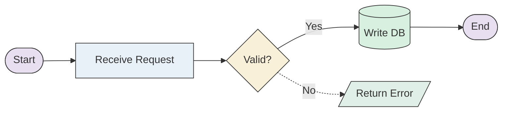
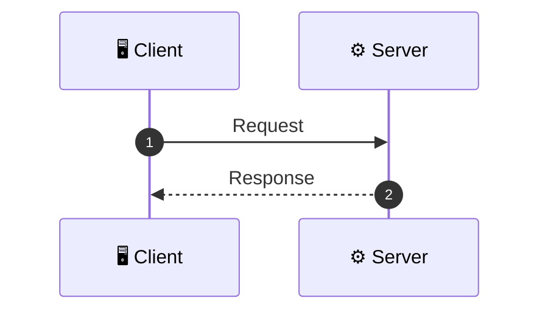
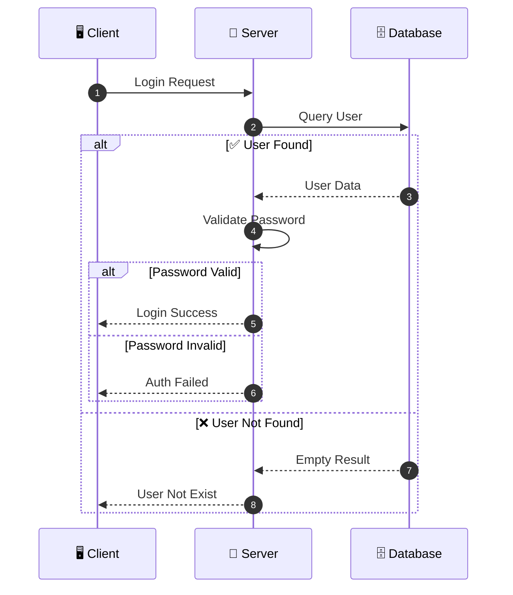
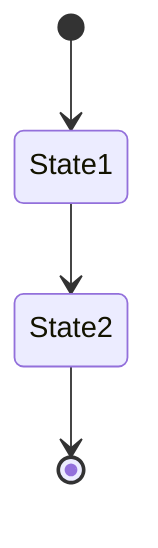
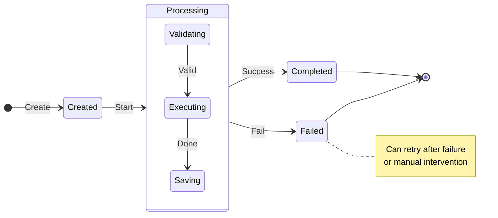

# Backend Technical Design Document

Turn a feature's requirements into a design document a team can actually review: one that states what changes, shows the flow per interface, and names the schema and resource work it implies.

Not for: recording a single decision and what was rejected, which is a one page `adr`. Use this when there are interfaces, flows, and a schema to specify.

## Inputs

Gather whatever exists before writing, a spec, ticket, PRD, design notes, an MR/PR diff, or the user's description. Read the relevant source code to ground the design in what is actually there. If you have nothing but a one-line request, ask for the requirement first; do not invent a feature.

## Document Structure

Generate these sections in order. **Omit any section that does not apply**, remove it entirely rather than leaving an "N/A" placeholder.

- **1. Business Background:** objective and measurable targets. Concise, no reference links.
- **2. Requirement Analysis**
  - Current status (brief; not a pain-point essay)
  - Business goals
  - Feature module division (no priority levels)
  - Use case diagram, *only if* multiple user roles are involved
- **3. System Design**
  - Network topology, *only if* distributed
  - Overall architecture diagram (Mermaid `flowchart LR`), highlighting what changes
  - Data synchronization, *only if* cross-system sync is involved
  - Domain model / ER diagram, *only if* the data model changes
  - Schema definitions, include **only** the subsections that are actually affected: database tables, search index, cache structure, MQ messages, configuration
- **4. Core Changes:** the heart of the document. For each interface or change point, use a flat `### 4.x` heading (never `#### 4.1.1`) containing:
  - **One comprehensive flowchart** combining main, branch, and exception flows
  - **A sequence diagram** showing system interactions, with `alt`/`else` for branches
  - **A field change table** describing fields and read/write logic

  Async flows (MQ consumers, cron/background jobs) get their own `### 4.x` section. Add a state diagram *only if* state transitions exist, and interface definitions *only if* API/RPC contracts change (service + method, then request/response bodies, separated per interface).
- **5. Checklist:** DDL changes and resource-application tasks only. No priority levels.

If the change introduces something the structure above does not cover, add it under the section where it belongs.

## Writing Rules

1. **Only Mermaid** for diagrams, no ASCII art, no external image tools.
2. **Conditional sections**: relevance decides inclusion; empty sections are deleted, not stubbed.
3. **One language throughout**, match the language of the source material and the user; never mix.
4. **Ground every claim** in the spec or the code. Where information is genuinely missing, omit the section rather than writing "to be supplemented".
5. **Regenerate rather than patch.** When the design changes materially, rewrite the document from its sources instead of hand-editing it into inconsistency.

---

## Diagram Standards

### Flowchart Standards

> Flowcharts display business process flows, use `flowchart LR` (left to right)

#### 1. Structure Guidelines

- Use `flowchart LR` (default left-to-right flow)
- Clearly define phases: **Request Entry → Core Processing → Data Storage → Return Result**
- Main flow must be a clear "single directional main path"
- Use decision nodes (diamond `{}`) for branching logic
- ❌ No messy crossing lines allowed
- ❌ No multiple parallel main paths without convergence points

#### 2. Node Design Standards

| Node Type     | Shape Syntax | Example                |
| :------------ | :----------- | :--------------------- |
| Start/End     | `([Text])`   | `([Start])`, `([End])` |
| Process Step  | `[Text]`     | `[Validate Params]`    |
| Core Module   | `[[Text]]`   | `[[Execute Match]]`    |
| Decision      | `{Text?}`    | `{Valid?}`             |
| Data Storage  | `[(Text)]`   | `[(MySQL)]`            |
| Message Queue | `{{Text}}`   | `{{BMQ}}`              |

**Node Text Guidelines**:

- Each node text should not exceed two lines
- Use verb phrases: `Validate Params` / `Build Features` / `Execute Match`
- ❌ No long descriptions allowed

#### 3. Visual Styling - Color Standards

Use `classDef` to define color tones matching the standard flowchart palette:



| Color        | Class      | Shape      | Usage                 | Hex Value    |
| :----------- | :--------- | :--------- | :-------------------- | :----------- |
| Light Purple | `startEnd` | `([Text])` | Start/End nodes       | fill:#E8E0F0 |
| Light Blue   | `process`  | `[Text]`   | Process steps         | fill:#E8F0F8 |
| Light Yellow | `decision` | `{Text}`   | Decision/branch nodes | fill:#F8F0D8 |
| Light Green  | `storage`  | `[(Text)]` | Database/storage      | fill:#D8F0E0 |
| Mint Green   | `io`       | `[/Text/]` | Input/Output          | fill:#E0F0E8 |
| Light Red    | `error`    | `[Text]`   | Error handling        | fill:#FFE0E0 |

#### 4. Arrow Standards

| Arrow Type           | Syntax               | Usage                                 |
| :------------------- | :------------------- | :------------------------------------ |
| Main Path            | `-->`                | Normal flow (solid line)              |
| Exception/Async Path | `-.->`               | Exception or async flow (dashed line) |
| ❌ Forbidden         | `-,->`, `--x`, `--o` | Will cause syntax errors              |

**Branch Label Guidelines**:

- Branch arrows must be labeled with `Yes/No` or `Success/Fail`
- Label key steps with protocol or action: `|RPC|`, `|SQL|`, `|Async|`

#### 5. Complexity Control

| Metric           | Threshold | Recommendation                          |
| :--------------- | :-------- | :-------------------------------------- |
| Node Count       | > 12      | Split into multiple phase diagrams      |
| Line Count       | > 20      | Split into sub-flows                    |
| Steps per Phase  | ≤ 4~5     | Keep it clear                           |
| Explanation Time | ≤ 1 min   | Flowchart should be quickly explainable |

### Architecture Diagram Standards

> Architecture diagrams display system component relationships, use `flowchart LR` (left to right)

- Use `subgraph` for layered design (Access Layer / Business Layer / Infrastructure Layer)
- Maximum 5 nodes per layer
- One diagram expresses one core concept

### Sequence Diagram Standards

**Mermaid SequenceDiagram Syntax**:



**1. Structure Guidelines**:

- Use `autonumber` for automatic numbering to track call sequence
- Group participants: External System → Gateway → Core Service → Storage
- Only keep key RPC/DB/Cache/MQ operations

**2. Visual Styling - Arrow Standards**:

- `->>` : Sync request (solid line)
- `-->>` : Response return (dashed line)
- `--)` : Async message (dashed line without arrow)

**3. Branch Scenarios - Alt/Else Syntax**:



**4. Protocol Labels**:

- Label protocol types in messages: `[HTTP]`, `[RPC]`, `[SQL]`, `[Redis]`

### ER Diagram Standards

**Mermaid ER Diagram Syntax**:

```
erDiagram
    USER ||--o{ ORDER : places
    USER {
        int id
        string name
    }
    ORDER {
        int order_id
        decimal amount
    }
```

**Basic Rules**:

- For `decimal`: Use `decimal` without parameters (avoid `decimal(10,2)`)
- For `varchar`: Use `string` type

**Relationship Symbols (CRITICAL)**:

- `||--||` : One-to-One (exactly one on both sides)
- `||--o|` : One-to-Zero-or-One (one side required, other side optional)
- `||--o{` : One-to-Many (one required, many optional)
- `||--|{` : One-to-Many (one required, at least one on many side)
- `}o--o{` : Many-to-Many (both sides optional)

**Relationship Writing Rules** (CRITICAL):

1. **Always write from LEFT to RIGHT**: `LeftEntity ||--o{ RightEntity`
2. **Left side symbols**: `||` (exactly one) or `}o` (zero or more) or `}|` (one or more)
3. **Right side symbols**: `||` (exactly one) or `o|` (zero or one) or `o{` (zero or more) or `|{` (one or more)
4. **Read as**: "LeftEntity [has] RightEntity"

### State Diagram Standards

**Mermaid StateDiagram Syntax**:



**1. Structure Guidelines**:

- Use `stateDiagram-v2` keyword
- Group states: Initial → Intermediate → Terminal
- Mark exception states separately

**2. Visual Styling - State Grouping**:



---

## Mermaid Validation Rules

After writing the document, perform **static syntax validation** on ALL Mermaid code blocks:

- **DO NOT use mermaid-cli** - it may not be installed and has version compatibility issues
- For each `mermaid` code block, manually verify against this checklist:

### Validation Checklist

**Flowchart Validation**:

- ✅ Uses `flowchart LR` or `flowchart TD` (not `graph`)
- ✅ Node text with special chars is quoted: `A["Text with spaces"]`
- ✅ Only allowed arrows: `-->`, `-.->`, `==>` (NO `-,->`, `--x`, `--o`)
- ✅ Arrow labels are simple: `-->|Label|` (no `[]`, `<>`, or special chars in labels)
- ✅ Subgraph syntax: `subgraph Name["Title"]` or `subgraph Name`

**Sequence Diagram Validation**:

- ✅ All `alt`/`opt`/`loop` blocks have matching `end`
- ✅ **NO `box` syntax** (not supported in Mermaid 9.x)
- ✅ Participant aliases don't contain special chars

**ER Diagram Validation**:

- ✅ Uses `erDiagram` keyword (not `er-diagram` or `ERDiagram`)
- ✅ Data types use simple names: `decimal` not `decimal(10,2)`, `string` not `varchar(255)`
- ✅ **Relationship format**: `ENTITY1 SYMBOL ENTITY2 : "label"` (label in quotes, colon required)
- ✅ **Valid relationship symbols** (left-to-right only):
  - `||--||` (one-to-one)
  - `||--o|` (one-to-zero-or-one)
  - `||--o{` (one-to-many, optional)
  - `||--|{` (one-to-many, required)
  - `}o--o{` (many-to-many)
  - `}|--|{` (many-to-many, both required)
- ✅ **NO invalid symbols**: `|o--o|`, `{|--|{`, `--`, `->`, `<-` are INVALID
- ✅ **Entity names**: Use UPPERCASE or PascalCase, NO spaces, NO special chars
- ✅ **Attribute format**: `type name "comment"` (comment in quotes, under 20 chars)
- ✅ **NO empty entities**: Each entity must have at least one attribute or relationship

**State Diagram Validation**:

- ✅ Uses `stateDiagram-v2` keyword
- ✅ State names have no spaces (use aliases: `state "Name" as Alias`)

**If issues found**:

1. Fix the syntax error in the Mermaid code
2. Re-write the corrected content to the file using Write tool
3. Re-validate until all checks pass

**Common Fixes**:

- Unquoted text → Add quotes: `A[Text]` → `A["Text"]`
- Wrong arrow → Replace: `-,->` → `-.->`, `--x` → `-->`
- Complex labels → Simplify: remove `[]`, `<>`, `<br/>`
- `box` syntax → Remove entirely (use comments for grouping instead)
- ER relationship without label → Add label: `A ||--o{ B` → `A ||--o{ B : "1:N"`
- ER invalid symbol → Fix direction: `{o--||` → `||--o{`
- ER decimal type → Simplify: `decimal(10,2)` → `decimal`

---

## Success Criteria

✅ Structure order: Background → Requirement Analysis → System Design → Core Changes → Checklist
✅ Required sections present (Business Background, Requirement Analysis, System Design, Core Changes, Checklist)
✅ Optional sections only included when relevant (Use Case, Network Topology, State Diagram, ER Diagram, Interface Definitions)
✅ Domain Model / ER Diagram placed in the System Design section
✅ Schema sections in System Design only include relevant subsections (no empty DB/ES/MQ/Cache sections)
✅ Core Changes use flat structure (### 4.x only, no sub-headings like #### 4.1.1)
✅ Each interface has ONE comprehensive flowchart combining all flows
✅ Sequence diagrams use alt/else for different scenarios
✅ Core Changes include field change table after diagrams
✅ Every Mermaid block passes the validation checklist above
✅ Tables are well-formed with proper column alignment
